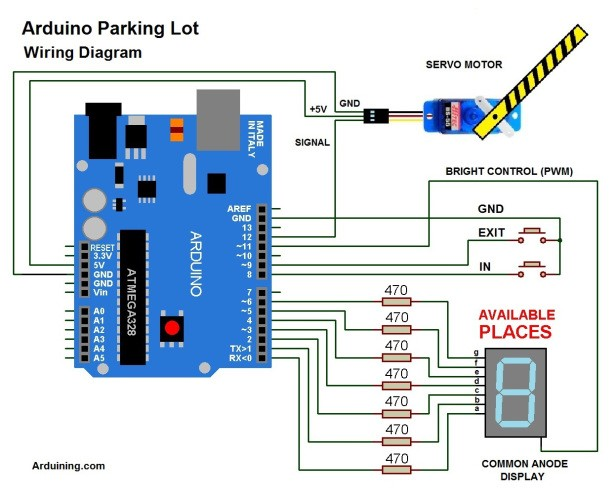
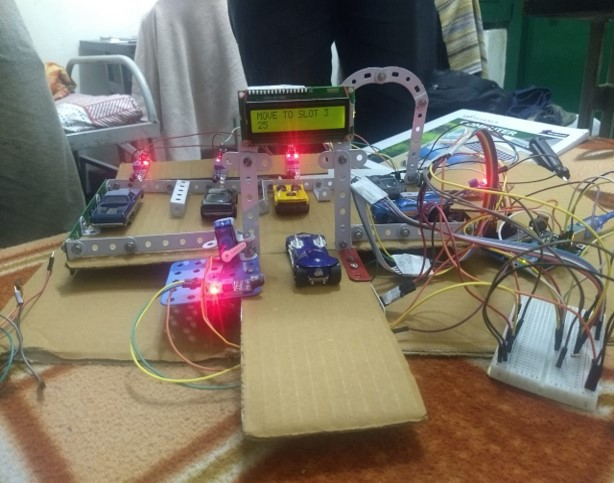
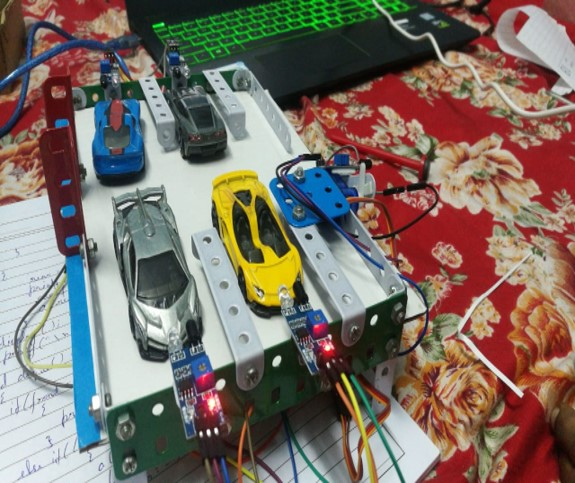
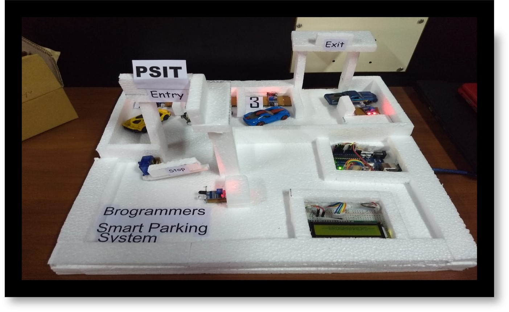

# <u>**Smart Parking System**</u>
*PRANVEER SINGH INSTITUE OF TECHNOLOGY*
### Department of Computer Science & Engineering | Pranveer Singh Institute of Technology, Kanpur, Uttar Pradesh India
### **ASHUTOSH VERMA || AVANISH JAISWAL || AYUSH KESARWANI || AYUSH MOHAN AWASTHI || AYUSH SINGH** 

## Abstract

Today, half of the population is living in the urban areas. So as urbanization is increasing we need more convenient way of transportation. One of the problem related to the transportation is unavailability of parking space. Most of the time drivers find difficulties in parking their vehicle at the peak hours, which leads to the problems such as fuel wastage as well as environmental pollution. In our proposed smart parking system, we are going to try to overcome these problems using Arduino and IR sensors in each lane and display the result on the user interface device, which helps driver to find the vacant parking slots more conveniently. 

## Functional Units
> 1. Arduino UNO (<https://www.arduino.cc/>)
> 2. Infrared Sensor (<https://www.amazon.in/slp/infrared-sensor/cenavo37j9s4fkz>)
> 3. Servo Motor (<https://circuitdigest.com/article/servo-motor-basics>)
> 4. LCD Display (<https://howtomechatronics.com/tutorials/arduino/lcd-tutorial/>)
> 5. Power Supply

## Advantages
> On Street
>> - Traffic congestion decreases
>> - Pollution is reduced
>> - Local business get improved footfall as parking capacity is maximized
>> - Streets are safer-drivers not distracted by hunting for spaces
>> - Drivers less stress and have more time to do things other than parking.
>> - Best possible use of available space

> Off Street
>> - Customers are happier because they can find spaces quickly and easily.
>> - Less time spent on parking results in more time to use your services.
>> - Traffic flow improves, saving time and increasing safety.
>> - Space available gets maximum use 

### Applications
> Our solution can be installed in:
>> - Schools/colleges
>> - IT Parks.
>> - For road traffic control and management Beside this it has a great value in its future scope.

### Circuit Diagram

### Conclusion

This designed parking system is a simple, economic and provides effective solution to reduce the carbon footprints in the atmosphere. It reduces the risk related with the finding of parking slots in any parking area and it eliminates unnecessary travelling of vehicles across the filled parking slots in a city. 

### Images of our Prototype
Prototype 1             |  Prototype 2             |  Prototype 3
:----------------------:|:------------------------:|:------------------------:
  |    |  

### Video 

